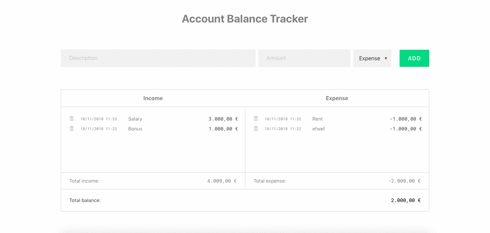

# Account Balance Tracker

### See [demo](https://distracted-joliot-d9690a.netlify.com/)

## Technologies

- React

## Features

- Takes description and amount for your income or expense

- Saves the time and date of your entry

- Calculates total for your income and expense and total balance

- If you go into debt your balance turns red

- You can delete each of the entries

- You can edit entry description inline

- Saves your data to the local storage

## Getting started

`> git clone https://github.com/antonijak/1.3.-Account-Balance-Tracker-React.git`

`> cd 1.6.-Blog-App-Redux-and-Router`

`> yarn install`

`> yarn start`

